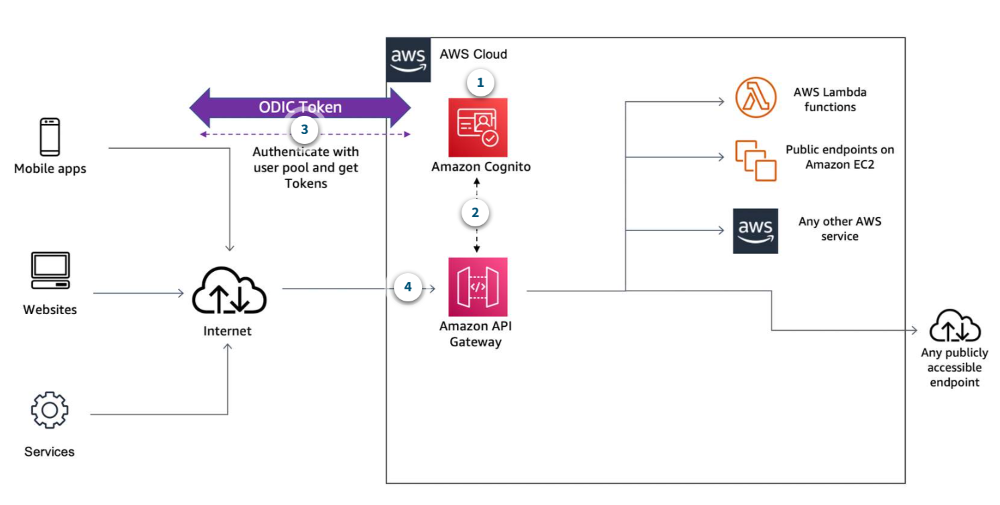

<h1>Amazon API Gateway for serverless applications

- API Gateway is a server that acts as an API front-end, receiving API requests,handling traffic management, Cross Origin Resource Sharing (CORS) support, authorization and access control, throttling, monitoring, and API version management. 
- Developer features: 
  -  Run multiple API versions simultaneously quickly iterate, test, and release new versions.
  -  quick SDK generation for multiple platforms, including Java, .NET, Node.js, and Python.
  -  Transform API requests and responses data
-  Features for managing API Access:
   -  Reduce latency and throttle traffic
   -  Built-in Authorization: Authorize access to API with AWS Identity and Access Management (IAM) and Amazon Cognito. If you use OAUTH, API gateway also offer OpenID connect (OIDC) and OAUTH 2 support.
   -  API Keys for 3rd party developers 

##  API types:

- REST API:  REST APIs are designed to be flexible and can be used for a wide range of applications. They support both JSON and XML data formats, and they can be used to create APIs that are accessible over the internet or within a private network.
- HTTP API: HTTP APIs are designed to be simple and easy to use. They support only JSON data format and are optimized for low-latency, high-throughput applications. They are ideal for building APIs that are used for real-time applications, such as mobile apps or IoT devices. 
- WebSocket API: WebSocket APIs are designed for real-time, bidirectional communication between clients and servers. They are ideal for applications that require low latency and high throughput, such as chat applications, gaming, and financial trading platforms. WebSocket API supports two-way communication between client apps and your backend. The backend can send callback messages to connected clients.

Choose REST APIs if you need features such as **API keys, per-client throttling, request validation, AWS WAF integration, or private API endpoints**. Choose HTTP APIs if you don't need the features included with REST APIs.

Designing Web Socket APIs

When you connect the client to API Gateway, API Gateway will manage the persistence and state needed to connect it to your clients. Unlike a REST API, which receives and responds to requests, a WebSocket API supports two-way communication between your client applications and your backend. The backend can send callback messages to connected clients. You can use WebSocket APIs to build real-time applications, such as chat applications, gaming, and financial trading platforms.

Creating and configuring a Websocket API: 

To create a functional API, you must have at least one route, integration, and stage before deploying the API. 

Route: A route is a URI path and an HTTP method that API Gateway uses to route requests to the backend. For example, you can create a route with the path /users and the HTTP method GET to retrieve a list of users from your backend.
Integration: An integration is the backend that API Gateway routes requests to when a client calls a route. For example, you can create an integration with an AWS Lambda function that retrieves a list of users from a database.
Stage: A stage is a logical reference to a lifecycle state of your API. You can use stages to manage different versions of your API, such as development, staging, and production. When you deploy your API, you specify a stage to deploy it to. For example, you can deploy your API to a stage named prod to make it available to your clients.

Maintaining connections to WebSocket APIs

Connect: When a client connects to a WebSocket API, API Gateway creates a connection and assigns it a unique connection ID. The client can then send messages to the backend through this connection.
Established connection: Once the connection is established, the client can send messages to the backend, and the backend can send messages back to the client. API Gateway manages the persistence and state needed to maintain the connection.
Disconnect: When a client disconnects from a WebSocket API, API Gateway deletes the connection and its associated state. The backend can also disconnect a client by sending a disconnect message to API Gateway.

Pricing considerations for Websocket APIs
Flat charge: WebSocket APIs for API Gateway charge for the messages you send and receive. You can send and receive messages up to 128 KB in size
Connection minutes: You are charged for the time that your clients are connected to your WebSocket API.  
Additional charges if you use API Gateway in conjunction with other AWS services or transfer data out of AWS.

>Note
**There are three predefined routes that can be used with WebSocket APIs: $connect, $disconnect, and $default. In addition to the predefined routes, you can also create custom routes.**

---
API Gateway REST API endpoint types

- Edge-optimized:  API Gateway uses the Amazon CloudFront content delivery network (CDN) to optimize API performance for geographically dispersed clients. This is the default endpoint type.
- Regional:  API Gateway is deployed in the same region as your backend services. Provides low latency for applications that invoke your API within the same AWS region.
- Private:  API Gateway is deployed in your Amazon Virtual Private Cloud (VPC) and is accessible only from within your VPC. This is ideal for internal APIs that are not exposed to the public internet.

the following endpoint type changes are allowed:

From edge-optimized to regional or private
From regional to edge-optimized or private
From private to regional

Can't change private to edge-optimized directly, you need to change it to regional first and then to edge-optimized.

API Gateway optional cache: 

API Gateway cache: API Gateway caches responses from your endpoint for a specified Time-to-Live (TTL) period. API Gateway then responds to a request by looking up the endpoint response from the cache instead of making a request to your endpoint
- It reduces overall latency for serving requests and also reduces the load on your backend.
- It minimizes the number of requests that need to be made to your backend.

Pricing considerations for REST APIs

Flat charge:  have a flat charge per million API Gateway requests.
Data Transfer out: Data transfer out of AWS 
Optional cache: optionally provision a dedicated cache for each stage of your APIs. After you specify the size of the cache you require, you will be charged an hourly rate for each stage's cache.

Building and deploying API with API Gateway

Anatomy of the API Calls

When a client application calls an API method, API Gateway performs the following steps:

The base API URI pattern is 

https://{restapi_id}.execute-api.{region}.amazonaws.com/{stage_name}/{resource_path}.

APIs created with API Gateway follow a common pattern, but you can customize the domain name using base path mapping.
If you choose to configure resource as a proxy, it will automatically create a specific HTTP method called Any.

API Gateway is integrated with AWS Certificate Manager (ACM) and lets you import your own certificate or generate a Secure Sockets Layer (SSL) certificate with ACM. API Gateway uses the certificate to encrypt data in transit between clients and API Gateway. If you use a custom domain name for your API, you can use an ACM certificate to secure the custom domain name.

Steps to build an API with API Gateway:

1. Create an API: You can create a REST API or an HTTP API using the API Gateway console, AWS CLI, or AWS SDKs. When you create an API, you specify the API name, description, and endpoint type (edge-optimized, regional, or private).

>Note
**A stage is a snapshot of the API that represents a unique identifier for a version of a deployed API. With stages, you can have multiple versions and roll back versions. Anytime you update anything about the API, you need to redeploy it to an existing stage or to a new stage that you create as part of the deploy action.**

## Managing API Access: 

### Authorization for API Gateway: 

Three main ways to authorize API calls to your API Gateway endpoints:

- Use `IAM and Signature version 4` (also known as Sig v4) to authenticate and authorize entities to access your APIs.
- Use `Lambda Authorizers`, which you can use to support bearer token authentication strategies such as `OAuth` or `SAML`
- Use` Amazon Cognito` with user pools.

External consumer: Recommended Lamabda Authorizers or Amazon Cognito  


Authorizing with I AM: 
Steps to authorize API calls with IAM:
1. Turn on AWS IAM authorization, all requests from the Mobile Apps/Web sites/ are required to be signed using the AWS Version 4 signing process (also known as Sig v4). 
2. **AWS I AM** process use your `AWS access key` and `secret key` to compute an` HMAC signature using SHA 256`. You can obtain these keys as an IAM user or by assuming an IAM role.
3. **AWS API Gateway** The key information is added to the Authorization header in the request and behind the scenes, API Gateway will take that signed request, parse it, and determine whether the user who signed the request has the IAM permissions to invoke your API.


Lambda Authorizers


1. A Lambda authoriser is an AWS Lambda function that performs custom authorization for your API Gateway APIs.  Ther are two types of Lambda authorizers: token-based and request parameter-based.

2. When a client calls your API, API Gateway verifies whether a Lambda Authorizer is configured for the API method.If so calls the Lambda Authorizer.
3. In this call, API Gateway supplies the authorization token (or the request parameters based on the type of authorizer), and the Lambda function returns a policy that allows or denies the caller’s request.
4. API Gateway supports policy caches, which means that if the same token is used in subsequent requests, API Gateway can reuse the policy returned by the Lambda Authorizer without invoking the Lambda function again. This can improve performance and reduce costs.

Token Authorizer flow: 

1. Http Request Header --> API Gateway</br>
2. API Gateway (pass source token) --> Lambda Authorizer function 
3. Lambda Authorizer function (return IAM policy) --> API Gateway
4. API Gateway (allow or deny) --> Http Response  
5. API Gateway (forward request) --> Backend service
6. Backend service --> API Gateway --> Http Response
7. API Gateway (forward response) --> Http Response
8. Http Response --> Client application

Input: 

```json
{
  "type": "TOKEN",
  "authorizationToken": "some token here",
  "authorizerUri": "arn:aws:apigateway:us-east-1:lambda:path/2015-03-31/functions/arn:aws:lambda:us-east-1:123456789012:function:my-authorizer-function/invocations",
  "authorizerCredentials": "arn:aws:iam::123456789012:role/apigateway-authorizer-role",
  "identitySource": "method.request.header.Authorization",
  "identityValidationExpression": "Bearer .*",  
  "authorizerResultTtlInSeconds": 300
}
```

Output: 

```json
{
  "principalId": "user|a1b2c3d4",
  "policyDocument": {
    "Version": "2012-10-17",
    "Statement": [
      {
        "Action": "execute-api:Invoke",
        "Effect": "Allow",
        "Resource": "arn:aws:execute-api:us-east-1:123456789012:example/prod/GET/mydemoresource"
      }
    ]
  },
  "context": {
    "someKey": "somevalue"
  }
}
```

Second type of `Lambda Authorizer is request parameter-based`, which uses a combination of request parameters to perform authorization. For example, you can use the source IP address and a custom header value to determine whether to allow or deny access to your API.

Input: 

```json
{
  "type": "REQUEST",  
  "authorizerUri": "arn:aws:apigateway:us-east-1:lambda:path/2015-03-31/functions/arn:aws:lambda:us-east-1:123456789012:function:my-authorizer-function/invocations",
  "authorizerCredentials": "arn:aws:iam::123456789012:role/apigateway-authorizer-role",
  "identitySource": "method.request.header.Authorization, method.request.querystring.Name", 
  "authorizerResultTtlInSeconds": 300
}
```

Cognito Authorizers: 

1. Amazon Cognito user pools are user directories that provide sign-up and sign-in options for your web and mobile apps. You can use a user pool to manage the users of your API and to control access to your API based on the groups that users belong to.

You can also create your own OAUTH2 resource servers and define custom scopes.




To use Amazon Cognito user pools as an authorizer for your API Gateway API, you need to do the following:

2.  first create an authorizer of the COGNITO_USER_POOLS authorizer type, and then configure an API method to use that authorizer.
3.  After a user is authenticated against the user pool, they obtain an OpenID Connect (OIDC) token formatted in a JSON web token.</br>
Users who have signed in to your application will have tokens provided to them by the user pool.</br>
Then that token can be used by your application to inject information into a header in subsequent API calls that you make against your API Gateway endpoint.

 Throttling and usage plans for API Gateway: 

 API Keys: create and distribute API keys to your customers, which can be used to identify the consumer and apply desired usage and throttle limits to their requests. Customers include the API key through x-API-key header in requests. 

API key with Usage plan to setup some very specific plans. 

- API Key Throttling per second and burst
- API Key Quota by day, week, or month
- API Key Usage by daily usage records

Token Bucket Algorithm

Requests that come into the bucket are fulfilled at a steady rate. If the rate at which the bucket is being filled causes the bucket to fill up and exceed the burst value, a 429 Too Many Requests error would be returned.

Throttling settings hierarchy

1. Per-client, per-method throttling limits that you set for an API stage in a usage plan
2. Per-client throttling limits that you set in a usage plan
3. Default per-method limits and individual per-method limits that you set in API stage settings
4. The account level limit

Granting access to your API in API Gateway

Who can access your API?
 execute-api permission, you need to create IAM policies that permit a specified API caller to invoke the desired API method. To apply this IAM policy on the API method, you need to configure the API method to use an authorization type of AWS_IAM.

 example policy to allow a user to invoke a specific API method:
```json
{
  "Version": "2012-10-17",
  "Statement": [
    {
      "Effect": "Allow",
      "Action": "execute-api:Invoke",
      "Resource": "arn:aws:execute-api:us-east-1:123456789012:example/prod/GET/mydemoresource"
    }
  ]
}
```

Who can manage your API?
To allow an API developer to create and manage an API in API Gateway, you need IAM permission policies that allow a specified API developer to create, update, deploy, view, or delete required API entities. To do that, create a policy using the apigateway:HTTP_VERB format, which allows the API developer to perform the desired API management actions on the specified API resources. Then, attach the policy to the API developer's IAM user or role.

sample policy to allow an API developer to create and manage an API in API Gateway:
```json
{
  "Version": "2012-10-17",
  "Statement": [
    {
      "Effect": "Allow",
      "Action": [
        "apigateway:GET",
        "apigateway:POST",
        "apigateway:PUT",
        "apigateway:DELETE"
      ],
      "Resource": [
        "arn:aws:apigateway:us-east-1::/restapis/*",
        "arn:aws:apigateway:us-east-1::/restapis/*/resources/*",
        "arn:aws:apigateway:us-east-1::/restapis/*/stages/*"
      ]
    }
  ]
}
```

Limit access by I AM user, IP Address, VPC Endpoint, or Referer

Monitoring and logging API calls to API Gateway

Count: Total number of API requests in a period

•
Latency: Time between when API Gateway receives a request from a client and when it returns a response to the client; this includes the integration latency and other API Gateway overhead

•
IntegrationLatency: Time between when API Gateway relays a request to the backend and when it receives a response from the backend

•
4xxError: Client-side errors captured in a specified period

•
5xxError: Server-side errors captured in a specified period

•
CacheHitCount: Number of requests served from the API cache in a given period

•
CacheMissCount: Number of requests served from the backend in a given period, when API caching is turned on

Execution logs:which logs what’s happening on the roundtrip of a request. 
Access logs: which logs who is calling your API, from where, and what they are calling.

## Monitoring:

After your APIs are deployed, you can use CloudWatch, CloudTrail, and X-Ray to monitor and log your deployed APIs.

X-Ray to trace and analyze user requests as they travel through your Amazon API Gateway
Gives end-to-end view of an entire request,also configure sampling rules to tell X-Ray which requests to record, and at what sampling rates, according to criteria that you specify.

AWS Cloud trail:  captures all API calls for API Gateway as events, including calls from the API Gateway console and from code calls to your API Gateway APIs. 

Data Mapping and Request validation in API Gateway: 

Mapping templates in API Gateway can be added to the integration request to transform the incoming request to the format required by the backend of the application or to transform the backend payload to the format required by the method response.

For invalid requests, API Gateway bypasses the integration altogether and returns an error response. By default, the error response contains a short descriptive error message. 
Allows customization of API responses by using mapping templates to modify the response body, headers, and status code.

API Gateway handle some of your basic validations, rather than making the call or building that validation into the backend. 

sample request validation for a POST method with a JSON payload:
```json
{
  "type": "object",
  "required": ["name", "age"],
  "properties": {
    "name": {
      "type": "string"
    },
    "age": {
      "type": "integer",
      "minimum": 0
    }
  },
  "title": "Request body validation for POST method"
}
```
