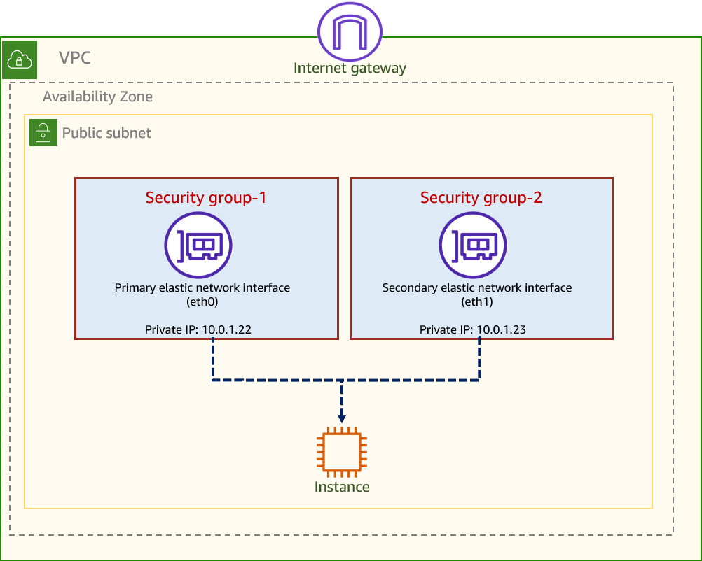

what is Compute?
 Compute is a generic term used to reference all the resources required for a program to successfully run. These resources include the processing power, memory, and other necessary resources needed for the computational success of the program. 

 Cloud computing: Cloud computing is the delivery of computing services, including servers, storage, databases, networking, software, analytics, and intelligence, over the Internet ("the cloud"). You typically pay only for the cloud services you use, helping you 
 - lower your operating costs
 - run your infrastructure more efficiently
 - scale as your business needs change. 

<h2>AWS compute options</h2>

**Compute:** 
 - `CPU` and GPU-based compute resources that can be used to run applications, process data, and perform various computational tasks.
 - `Memory`: Memory resources that can be used to store and access data quickly, which is essential for running applications and processing data efficiently.

 AWS offers services like Amazon EC2 Instances: Amazon Elastic Compute Cloud (Amazon EC2) provides resizable compute capacity in the cloud. It allows you to run virtual servers, known as instances, which can be used to host applications, process data, and perform various computational tasks. EC2 instances come in various types and sizes, allowing you to choose the right resources for your specific needs.

 **Containers:**
  Containers are a lightweight form of virtualization that allows you to package your code, configuration, and dependencies together, enabling you to run applications in a consistent environment. 
  AWS offers services like `Amazon Elastic Container Service (ECS)` you can deploy containerized workloads on a managed cluster of `Amazon EC2` instances. and `Amazon Elastic Kubernetes Service (EKS)` to manage and orchestrate containerized applications. 

  Serverless computing: Serverless computing is a cloud computing execution model where the cloud provider dynamically manages the allocation and provisioning of servers. In this model, you can run your code without having to worry about the underlying infrastructure. AWS offers services like `AWS Lambda`, which allows you to run code in response to events and automatically manages the compute resources for you.

  What is the difference between these compute options?

  | Compute Option | Description | Use Cases | benefits |
  | --- | --- | --- |--- |   
  | Amazon EC2 Instances | Virtual servers in the cloud you decide the CPU, memory and storage that can be used to run applications. AWS manages the underlying physical hardware and infrastructure. | Hosting applications, running databases, processing data, and performing various computational tasks. |Quick build and start with a wide range of instance types and sizes, Flexible to scale up or down based on demand. Complete control |
  | Containers | A lightweight form of virtualization that allows you to package your code, configuration, and dependencies together, enabling you to run applications in a consistent environment. The containerized application can run on an AWS EC2 Instance or a serverless with Fargate. | Deploying and managing containerized applications, microservices architecture, and scaling applications efficiently. | Consistent environment, portability, run without latency unlike other computing, |
| Serverless Computing | A cloud computing execution model where the cloud provider dynamically manages the allocation and provisioning of servers. You can run your code without having to worry about the underlying infrastructure. | Running event-driven applications, building APIs, processing data in real-time, and short lived app
. | Fast development focus only on building and refining your application, pay only for usage |

How to choose the right compute option for your application?
    Choosing the right compute option for your application depends on several factors, including the specific requirements of your application, your budget, and your team's expertise. Here are some guidelines to help you make an informed decision:

When you have compute-intensive or memory-intensive applications, consider the following:    
- If you need complete control over the underlying infrastructure and want to run applications that require specific configurations,` Amazon EC2` provides each instance with a consistent and predictable amount of CPU capacity,. It allows you to choose the right instance type and size based on your application's needs.

For compute-intensive workloads, For large monolithic applications, Fast application deployment and scaling:.

- If you want to deploy and manage containerized applications, especially if you are adopting a microservices architecture, using containers with `Amazon ECS` or `Amazon EKS` can provide a consistent environment and efficient scaling.

 
When not to containerise  1. Applications that have no state information and don't require complex persistent storage would be better candidates for using a container solution than an application with complex storage needs.   2. Application have more complex n/w, routing or security requirements**

- **If you want to focus on building and refining your application without worrying about the underlying infrastructure,less computing service? Application that don't run longer than 15 mins** then serverless computing with `AWS Lambda` can be a great option. It allows you to run code in response to events and automatically manages the compute resources for you, which can lead to faster development and cost savings. Ultimately, the choice of compute option will depend on your specific use case, and you may even find that a combination of these options works best for your application.

<h2>Other AWS compute services</h2>

what is AWS Lambda function?
 AWS Lambda is a serverless compute service that allows you to run code without provisioning or managing servers. With Lambda, you can execute your code in response to events such as changes to data in an Amazon S3 bucket, updates to a DynamoDB table, or HTTP requests via Amazon API Gateway. 

What is AWS Step Functions?
    AWS Step Functions is a serverless orchestration service that allows you to coordinate multiple AWS services into serverless workflows. With Step Functions, you can design and run workflows that stitch together services such as AWS Lambda, Amazon ECS, and Amazon SNS to build complex applications. Step Functions provides a visual interface for designing your workflows and automatically manages the underlying infrastructure for you.

What is AWS Batch?
    AWS Batch is a fully managed batch processing service that allows you to run batch computing workloads on the AWS Cloud. With AWS Batch, you can easily and efficiently run hundreds to thousands of batch computing jobs, and it automatically provisions the optimal quantity and type of compute resources based on the volume and specific resource requirements of the batch jobs you submit.

    AWS Batch plans, schedules, and runs your batch computing workloads using Amazon EC2 and AWS compute resources with Fargate or Fargate Spot. 

what is AWS Elastic Beanstalk? 
Elastic Beanstalk automatically handles the deployment details of capacity provisioning, load balancing, auto-scaling, and application health monitoring. By using Elastic Beanstalk, developers can focus on developing their application and are freed from deployment-oriented tasks, such as provisioning servers, setting up load balancing, or managing scaling. 

what is Amazon Lightsail ? 

## AWS Networking: 
  -  [AWS Global Infrastructure](https://aws.amazon.com/about-aws/global-infrastructure/) page, which illustrates the locations of the available Regions and their corresponding Availability Zones. 
  -  AWS Region: A Region is a geographic area where AWS has deployed physical infrastructure and data centers. These data centers are arranged into logical groupings called Availability Zones
  -  selecting a Region: 
  -   Compliance with data governance and legal requrirements
  -   Proximity to end-users
  -   Service availability: Not all AWS services are available in every region, so you should check the [AWS Regional Services List](https://aws.amazon.com/about-aws/global-infrastructure/regional-product-services/) to ensure that the services you need are available in the region you choose.
  -   Pricing per region
  -  AWS Availability Zone: An Availability Zone (AZ) is a distinct location within a region that is engineered to be isolated from failures in other AZs. Each AZ consists of one or more data centers, and they are designed to provide high availability and fault tolerance. By deploying your applications across multiple AZs, you can improve the resilience of your applications and reduce the risk of downtime due to hardware failures or other issues.

### Virtual private cloud

A virtual private cloud (VPC)(opens in a new tab) is a private virtual network dedicated to your AWS account.

 Each VPC is logically isolated from other virtual networks in the AWS Cloud. 

**VPC types:**
  - `Default VPC`: Each AWS account comes with a default VPC in each region, which is ready to use and provides basic networking functionality. Usecase:  Getting started quickly and for launching public instances such as a blog or simple website

  - `Custom VPC`: You can create custom VPCs to have more control over your network configuration, including IP address ranges, subnets, route tables, and security settings. Custom VPCs allow you to design your network architecture according to your specific requirements and can be used to isolate different environments or applications within your AWS account.

### AWS networking

Subnets: A subnet consists of a smaller portion of your IP address range. 
  - Each subnets must reside entirely within one AZ and cannot span across AZs.
Subnetting(subnet masks)
- Its a 32-bit address that helps separate the network address from host address. Types: /24 or /16 in an IP address
- 255.255.255.255 is the subnet mask for a /32, which means that all 32 bits are used for the network address, leaving no bits for host addresses. This is typically used for a single host or device.
- Examples: 
- `10.0.1`.4/24 means 
   1. first 24 bits are used for the network address, 2. Remaining 8 bits are used for host addresses. This allows for a total of 256 IP addresses (2^8) within the subnet, with 254 usable host addresses (since the first and last addresses are reserved for network and broadcast purposes).
- `10.0.1`.4/26 means
   1. first 26 bits are used for the network address, 2. Remaining 6 bits are used for host addresses. This allows for a total of 64 IP addresses (2^6) within the subnet, with 62 usable host addresses (since the first and last addresses are reserved for network and broadcast purposes).
   3. 10.0.1 is the network address, and .4 is the host address(or any number b/w 1-62) within that network. 
- CIDR blocks: Classless Inter-Domain Routing (CIDR) is a method for allocating IP addresses and routing Internet Protocol packets. CIDR blocks are used to define the range of IP addresses that can be used within a subnet or VPC. `For example, a CIDR block of `
 10.0.0.0/24, it supports 256 IP addresses`. You can break this CIDR block into two subnets, each supporting 128 IP addresses. 
**One subnet uses CIDR block 10.0.0.0/25** (for addresses 10.0.0.0–10.0.0.127).
**The other uses CIDR block 10.0.0.128/25** (for addresses 10.0.0.128–10.0.0.255).

Five Reserved IP addresses in each subnet:

Reserved Address|	Purpose|
---|---|
First address (x.x.x.0)|	Network address
Second address (x.x.x.1)|	VPC router
Third address (x.x.x.2)|	DNS server
Fourth address (x.x.x.3)|	Future use
Last address (x.x.x.15)|	Broadcast address

- AWS doesn't support broadcast in VPC, so the last IP address in the subnet is reserved but not used for broadcasting. Instead, AWS uses it for future use.
- If I have a subnet range */28 then (32-28)= 4 bits for host addresses, which gives 2^4 =  16 total IP addresses are available*, but only 11 can be used for hosts because 5 are reserved by AWS.

**Network access control list (NACL)**
- It is a type of security filter, like a firewall, that can filter traffic as it enters and leaves a subnet. 
- By default, each custom network ACL denies all inbound and outbound traffic until you add rules.
- When your default virtual private cloud (VPC) is created, **a default network ACL** is created and associated with all subnets. **By default, it allows all inbound and outbound IPv4 traffic** and, if applicable, IPv6 traffic.
- You can create a **custom network ACL** and associate it with a subnet. By default, each **custom network ACL denies all inbound and outbound traffic until you add rules**.
- **NACL** is not required if two EC2 instance are in the same subnet, they can communicate with each other by default. However, if you want to control the traffic between instances in the same subnet, you can use security groups instead of NACLs. **Security groups** *act as virtual firewalls for your **EC2 instances** to control inbound and outbound traffic at the instance level*.
- **NACL are stateless** which means that they don't remember the routes that traffic took to come into your network and won't automatically send it back the same way. You have to mention the rules for both inbound and outbound traffic. 

## Launcing a EC2 instance

**Ways to launch an EC2 instance:**
- AWS Management Console: A web-based interface that allows you to interact with AWS services and manage
- AWS Command Line Interface (CLI): A command-line tool that provides a way to interact with AWS services using commands in your terminal or command prompt.
- AWS SDKs: Software Development Kits (SDKs) are available for various programming languages,
- AWS CloudFormation: A service that allows you to define and provision AWS infrastructure as code using templates.  third-party tools such as Terraform can also be used to manage AWS infrastructure as code.

Informations: 
- `AMI (Amazon Machine Image)`: An AMI is a pre-configured template that contains the necessary information to launch an EC2 instance. It includes the operating system, application server, and applications. You can choose from a variety of AMIs provided by AWS or create your own custom AMI.
- `Instance Type`: The instance type determines the hardware of the host computer used for your instance. t2.micro, t3.medium, m5.large, etc. Each instance type offers different combinations of CPU, memory, storage, and networking capacity, allowing you to choose the right resources for your applications.
- `Key Pair`: A key pair is used to securely connect to your EC2 instance. This is a combination of a public key that is used to encrypt data and a private key that is used to decrypt data.
  -Public key specified at launch instance is store in this path ~/.ssh/authorized_keys. You must specify the private key that corresponds to the public key and keep it safe.
- `Security Group`: A security group acts as a virtual firewall for your EC2 instance to control inbound and outbound traffic. You can specify rules in the security group to allow or deny specific types of traffic to and from your instance.
- `Subnet`: A subnet is a range of IP addresses in your VPC. When you launch an EC2 instance, you can specify the subnet in which to launch the instance. The subnet determines the availability zone and the network configuration for the instance.

Launching an EC2 instance involves selecting an AMI, choosing an instance type, *configuring security settings, and specifying other parameters such as key pairs and subnets*. Once you have configured the instance, you can launch it and connect to it using SSH (for Linux instances) or RDP (for Windows instances) using the private key associated with the key pair you specified during launch.
Use launch template to save the configuration of an EC2 instance, which can be used to launch new instances with the same configuration in the future. This can help you save time and ensure consistency when launching multiple instances with similar configurations.

Managing EC2 instance states 

EC2 instances can be in various states, such as `pending > running > stopping > stopped > terminated`. 

- `Pending`: The instance is preparing to enter the running state. During this state, you may incur charges for usage and data transfer until the instance is fully running.
- `Stopped`: No charges for usage and data tx, but charges for the EBS volumes.
- `Shutting-down`: The instance is in the process of stopping, but it is not yet fully stopped. During this state, you may still incur charges for usage and data transfer until the instance is fully stopped.
- `Terminated`: The instance is permanently deleted and cannot be restarted. Once an instance is terminated, you will not incur any further charges for that instance,also the data in the associated EBS volumes is deleted.
- `Hibernate`: Hibernation saves the contents from the instance memory (RAM) to your Amazon EBS root volume. Amazon EC2 persists the instance EBS root volume and any attached EBS data volumes. 
- Reboot (scheduled event)
- Retire  AWS detects irreparable failure of the underlying hardware that hosts the instance. If your instance root device is an EBS volume, the instance is stopped, and you can start it again at any time. If your instance root device is an instance store volume, the instance is terminated, and you can't start it again.

## Content Domain 1: Development with AWS Services

**Task 1: Develop code for applications hosted on AWS.
Knowledge of:**

- Architectural patterns (for example, event-driven, microservices, monolithic,
choreography, orchestration, fanout)
- Idempotency
- Differences between stateful and stateless concepts
- Differences between tightly coupled and loosely coupled components
- Fault-tolerant design patterns (for example, retries with exponential
backoff and jitter, dead-letter queues)
- Differences between synchronous and asynchronous patterns
Skills in:
- [] Creating fault-tolerant and resilient applications in a programming
language (for example, Java, C#, Python, JavaScript, TypeScript, Go)
- [] Creating, extending, and maintaining APIs (for example, response/request
transformations, enforcing validation rules, overriding status codes)
- [] Writing and running unit tests in development environments (for example,
using AWS Serverless Application Model [AWS SAM])
- [] Writing code to use messaging services
- [] Writing code that interacts with AWS services by using APIs and AWS SDKs
- [] Handling data streaming by using AWS services

**Task 2: Develop code for AWS Lambda.**

Knowledge of:
  - Event source mapping
  - Stateless applications
  - Unit testing
  - Event-driven architecture
  - Scalability
- The access of private resources in VPCs from Lambda code

Skills in:
  - Configuring Lambda functions by defining environment variables and
  parameters (for example, memory, concurrency, timeout, runtime, handler,
  layers, extensions, triggers, destinations)
  - Handling the event lifecycle and errors by using code (for example, Lambda
  Destinations, dead-letter queues)
  - Writing and running test code by using AWS services and tools
  - Integrating Lambda functions with AWS services
  - Tuning Lambda functions for optimal performance
  
**Task 3: Use data stores in application development.**

Knowledge of:
  - Relational and non-relational databases
  - Create, read, update, and delete (CRUD) operations
  - High-cardinality partition keys for balanced partition access
  - Cloud storage options (for example, file, object, databases)
  - Database consistency models (for example, strongly consistent, eventually
  consistent)
  - Differences between query and scan operations
  - Amazon DynamoDB keys and indexing
  - Caching strategies (for example, write-through, read-through, lazy loading,
  TTL)
  - Amazon Simple Storage Service (Amazon S3) tiers and lifecycle
  management
  - Differences between ephemeral and persistent data storage patterns
  
Skills in:
  - Serializing and deserializing data to provide persistence to a data store
  - Using, managing, and maintaining data stores
  - Managing data lifecycles
  - Using data caching services

How to create the subnet ? 

subnet calculation: 

lets say the IP address 192.168.13.1  
Sub net mask: 255.255.255.240 the last positions 255-240 = 15, but the 
hosts per sbunet is 14, since 1 is reserved for broadcast address
Hosts per subnet: 14 

255.255.255.192 means 255 - 192 = 

Data Transfer b/w 2 computers: 

`Application > Data > (network interface card)NIC > Packet > Tx in cable RJ45 Cable > packet > NIC> Data > Application`

A switch routes the traffic between the systems within networks 
IP Address, Subnet mask, Gateway - The IP Address of the Router inour case its the internet modem, 

